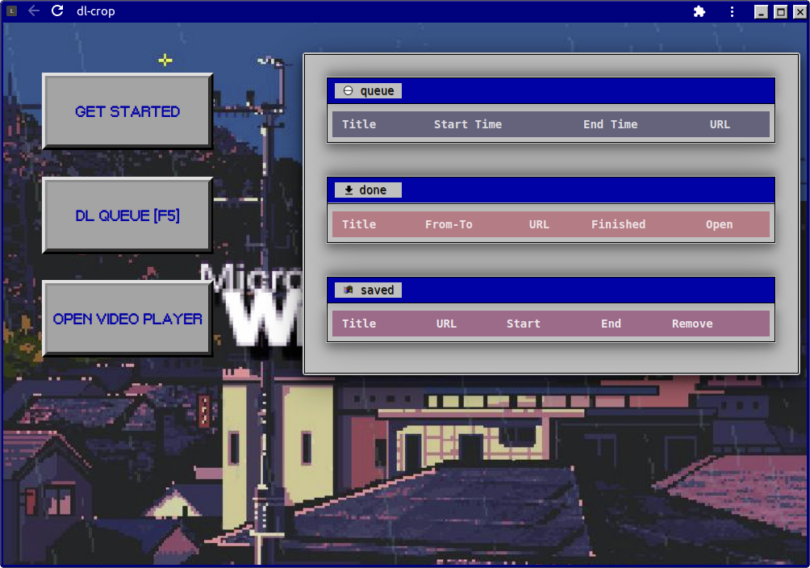

# dl-crop

###### ytdl wrapper for automated trim/crop post-processing

##### Search media w/ selenium browser OR use a URL list. Specify start and and times for cropping.

--------

### GUI TODO

- switch from cookies files to pickle objects
  - write usrSelection to pickle persistent object
- fix the logging of random log files with timecode filenames
- display in table:
  - thumbnail
    - parser or atomicparsley
  - video title
    - page.title
- When going to new youtube link, add hyperlink to previous in either directory  tree or playlist bar 
- Cross reference video title with APIs for:
  - better quality version available
  - torrent avaialble -> [use torrenting crx webapp?]
  - ?free download available
- Crop Options:
  - whole video / no crop
  - start -> time code
  - time code -> end
- Download Options:
  - playlist mode
  - channel mode
- add chrome_options to selenium user data to make the selelnium instance match the GUI
- if video player current time has a value, while True, constantly update a GUI element displyaing the time using vHS clock assets
- subtitle DL option
- youtube-dl options in GUI
- session budy / get all tabs functino via webbrowser / get all tabs function via selenium
- Options for other browsers (1) in try_driver
- abilitiy to crop twice (two clips) -- if there is 4 timecodes before another link 
- if no time code, or time code is just a 0, don't crop or use end of video as timer
- cntrl click a thumbnail to save link 

### dl-crop (old) TODO

###### Error Checking
- on errors:
  - try 
    - "--no-check-certificate"
    - "--force-ipv4"
  - remove "--hls-prefer-ffmpeg"
    - proxy from other country
    - recode to mp4 
    - on keyframe ffmpeg
- handle the WARNING: Requested formats are incompatible for merge and will be merged into mkv. errror -> change name

###### bymyself